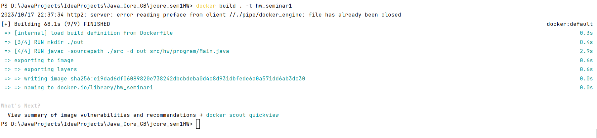

### Java Core (семинары)
#### Урок 1. Компиляция и интерпретация кода

Разработать приложение с лекции все-таки придется.

Создать проект из трёх классов (основной с точкой входа и два класса в другом пакете),
которые вместе должны составлять одну программу, позволяющую
производить четыре основных математических действия и осуществлять форматированный
вывод результатов пользователю (ИЛИ ЛЮБОЕ ДРУГОЕ ПРИЛОЖЕНИЕ НА ВАШ ВЫБОР, которое просто демонстрирует работу некоторого механизма).

Пример моего приложения я прикрепил к материалам урока.

Необходимо установить Docker Desktop.
Создать Dockerfile, позволяющий откопировать исходный код вашего приложения в образ для демонстрации работы вашего приложения при создании соответствующего контейнера.

Подобную процедуру мы с вами проделали на уроке, теперь необходимо проделать данную процедуру самостоятельно.
***

* Формирование документации

javadoc -d docs -sourcepath ./src/main/java -cp ./out -subpackages hw 

* Сборка образа по конфигурации Dockerfile

docker build . -t hw_seminar1

* Запуск контейнера

docker run --rm hw_seminar1

